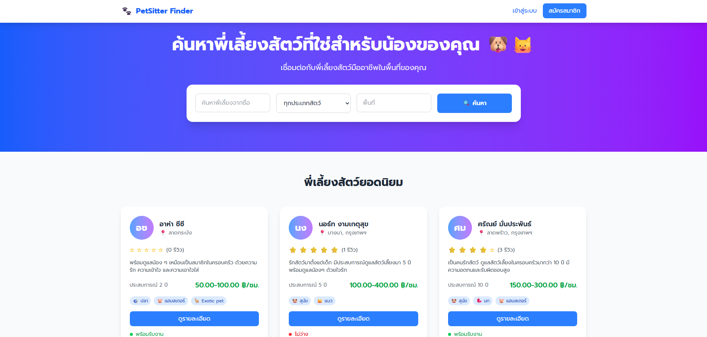
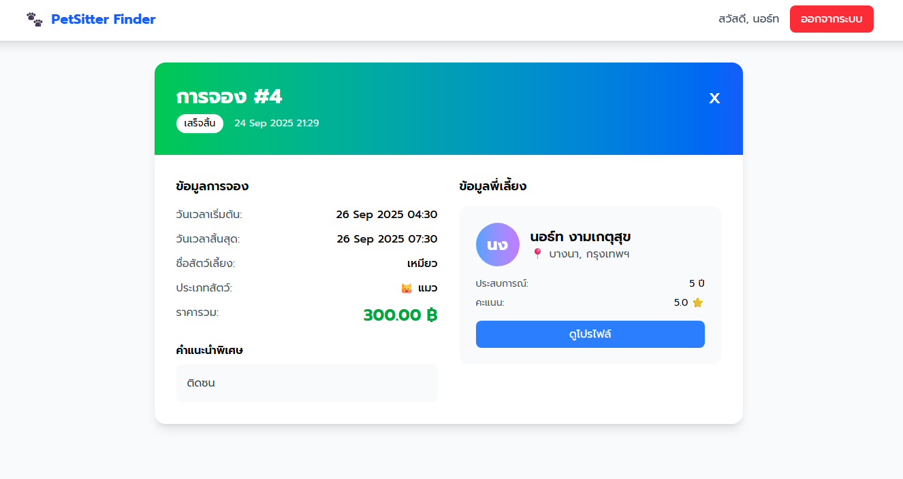

# 🐾 Pet-sitter Finder
**A full-stack web application for matching pet owners with trusted sitters.**

## 🌟 Overview
**Pet-sitter Finder** เป็นแพลตฟอร์มเว็บแอปพลิเคชันที่ช่วยให้เจ้าของสัตว์เลี้ยงสามารถค้นหาและจองบริการพี่เลี้ยงสัตว์เลี้ยงได้อย่างสะดวกสบาย โปรเจกต์นี้เน้นการจัดการระบบสมาชิก การจอง (Booking) และการรีวิว โดยให้ความสำคัญกับการทำ **Containerization** และระบบ **CI/CD** เพื่อการ Deploy ที่มีประสิทธิภาพบนระบบคลาวด์ 

---

## 📸 User Interface

  
  

  <em>ตัวอย่างอินเทอร์เฟซการค้นหาพี่เลี้ยงสัตว์เลี้ยงและข้อมูลการจองที่ใช้งานง่ายและรวดเร็ว</em>

---

## ✨ Key Features
* **Pet-sitter Matching:** ค้นหาพี่เลี้ยงที่เหมาะสมพร้อมระบบกรองข้อมูลและดูโปรไฟล์ของผู้ให้บริการ.
* **Booking System:** ระบบจัดการการจองที่ซับซ้อน รองรับการบันทึกข้อมูลผู้ใช้ การจอง และการให้คะแนนรีวิว.
* **Scalable Backend:** พัฒนาด้วย Django REST Framework และใช้ PostgreSQL ในการบริหารจัดการฐานข้อมูลความสัมพันธ์ที่มีความซับซ้อน.
* **Modern Frontend:** พัฒนาด้วย Tailwind CSS เพื่อให้ได้ UI ที่ทันสมัยและรองรับการใช้งานผ่านมือถือ (Responsive Design).

## 🛠 DevOps & Cloud Deployment Highlights
* **Containerization:** **Containerized** แอปพลิเคชันด้วย **Docker** และ **Docker Compose** เพื่อให้มั่นใจว่าสภาพแวดล้อมในการพัฒนาและใช้งานจริงเหมือนกัน 100%.
* **Cloud Infrastructure:** **Deployed** ระบบบน **Google Cloud Platform (GCP)** และ **Configured** **Nginx** เป็น Reverse Proxy และ Load Balancer เพื่อบริหารจัดการ Traffic อย่างมีประสิทธิภาพ.
* **Automated Pipeline:** **Streamlined** กระบวนการพัฒนาด้วย **CI/CD Pipeline** ผ่าน **Jenkins** ร่วมกับ GitHub Webhooks เพื่อทำระบบ Build, Test และ Deployment อัตโนมัติเมื่อมีการ Update Code.

---

## 💻 Tech Stack
| Category | Technology Used |
| --- | --- |
| **Backend** | Django (Python)  |
| **Frontend** | Tailwind CSS, JavaScript, HTML  |
| **Database** | PostgreSQL  |
| **Infrastructure** | Docker, Docker Compose, Nginx  |
| **Cloud & CI/CD** | Google Cloud Platform (GCP), Jenkins  |
